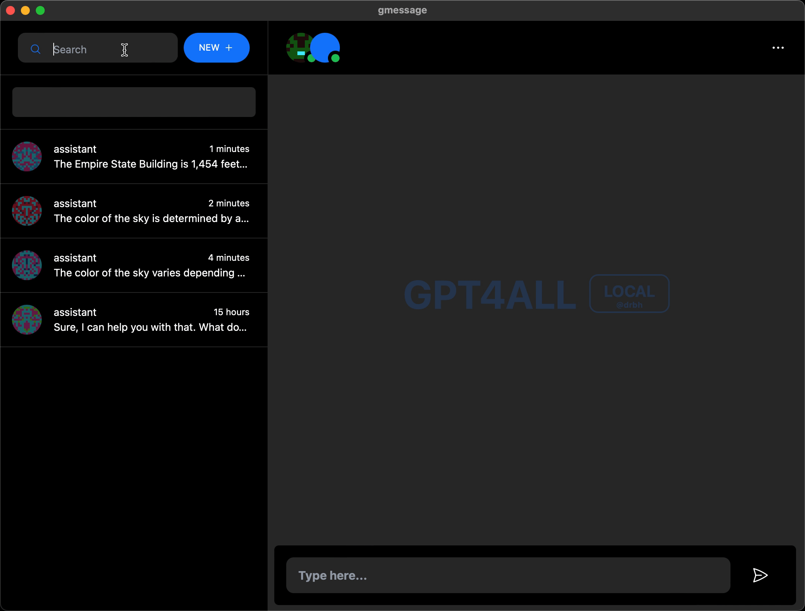
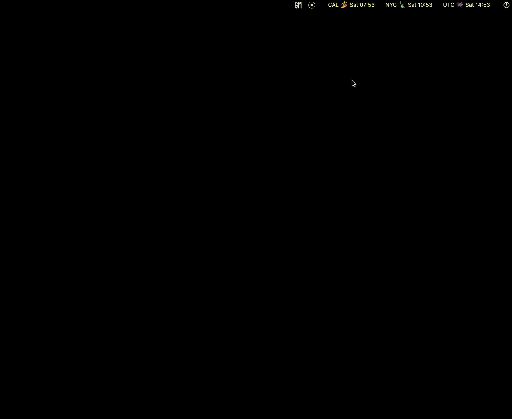

Chatbotting made beautiful with gmessage - a visual treat for local conversations.

gmessage is an easy and lite way to get started with a locally running LLM on your computer.

We are currently in alpha and mainly targeting OSX however the project should work on Linux and Windows as well it just hasn't been tested yet.

Contributions are more than welcome! and bugs are expected please report them [here](issues)


### Features

- ✅ Easy to use
- ✅ Beautiful UI
- ✅ Easy to install
- ✅ Lots of themes
- ✅ Search chat history
- ✅ Create, view multiple chats
- ✅ Text to speech
- ✅ Export chat to JSON file
- ✅ Menubar, Desktop & Web apps built-in
- Locally running LLM server


#### Search 


#### Themes


### Menubar
 

### From Python
Since we respond to and return the same JSON format as the OpenAI API you can use the same python code to interact with gmessage as you would with the OpenAI API.
```python
import openai

openai.api_key = ""
openai.api_base = "http://localhost:10999/api"

response = openai.Completion.create(
  model="gpt4all-mpt-7b",
  messages=[
        {
            "role": "system",
            "content": "You are a helpful assistant."
        },
        {
            "role": "user",
            "content": "Hello there."
        },
        {
            "role": "assistant",
            "content": "Hi, how can I help you?"
        },
        {
            "role": "user",
            "content": "Reverse a list in Python."
        }
    ]
)

print(response.choices[0])
```

### How to compile and run

Note: This will download a 4.5GB file (the MPT-7B model) please make sure you have enough space and a good internet connection.

```bash
make
bin/gmessage
```